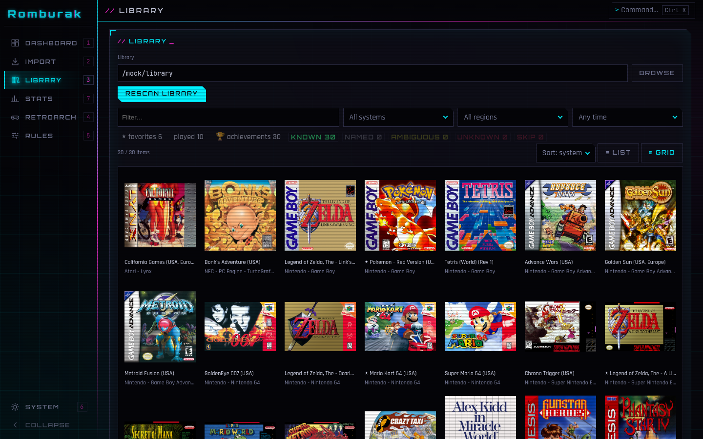
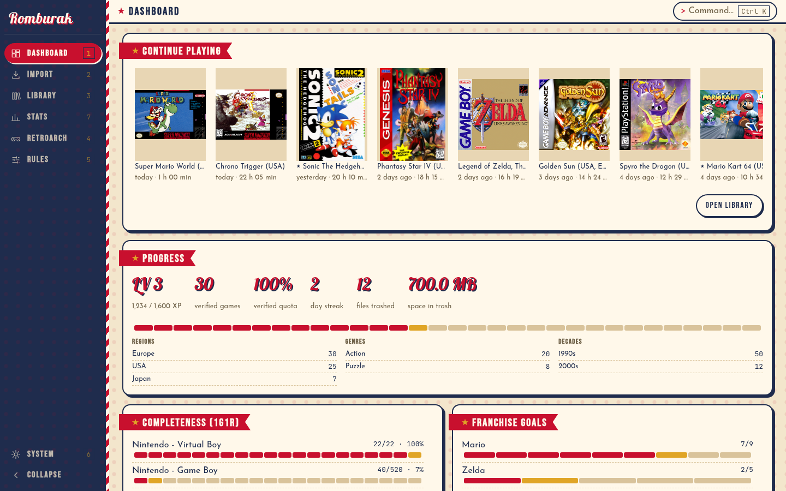
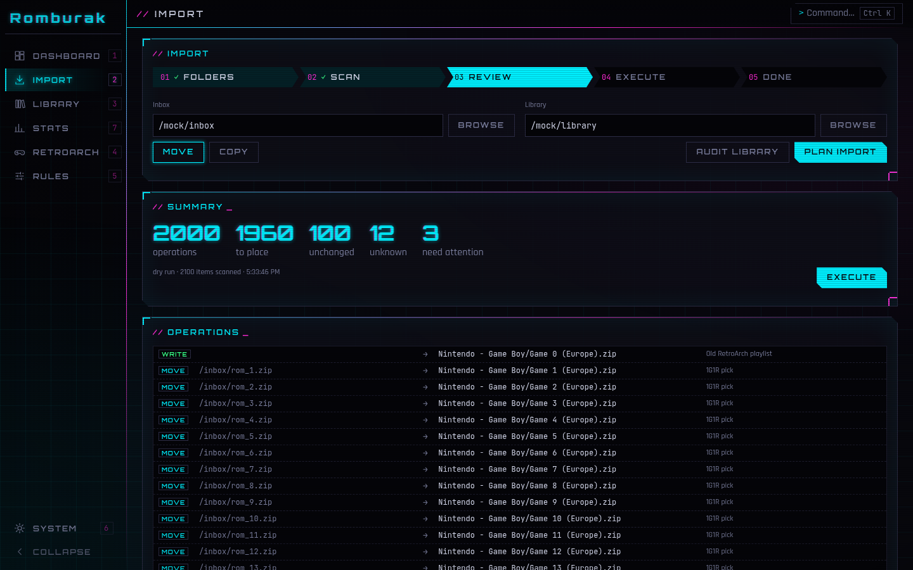
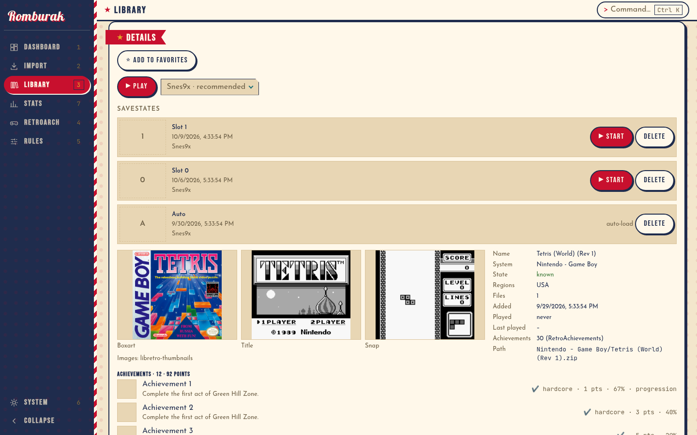
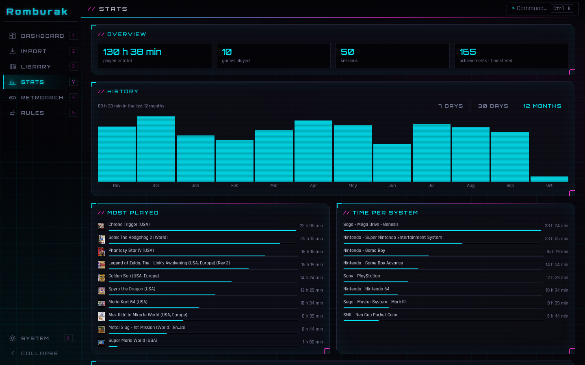

<div align="center">

# Romburak

A ROM manager and launcher built on the RetroArch databases.

[](https://github.com/khaledchaar-cpu/romburak/actions/workflows/ci.yml)




</div>

Romburak identifies every file by its hash, keeps one release per game and sorts the result
into a library that RetroArch can use as it is. It then starts the games itself, through a
RetroArch installation it downloads and manages on its own.

## Curating

- **Identification by hash.** CRC32 and SHA-1 (serials for disc images) are matched against
  the RetroArch databases and the FBNeo/MAME DATs. File names are not trusted.
- **One game, one release (1G1R).** Picks the best release for your region and language
  order. Betas, prototypes, demos, hacks and similar are filtered out unless you keep them.
- **Discs and archives.** cue/bin, gdi, CHD, CSO, zip and 7z. Multi-disc games stay together
  and get an `.m3u`; archives with unknown content are never split up.
- **Arcade.** FBNeo and MAME sets keep their short names, CHDs move with their set, BIOS
  sets go where the cores look for them.
- **Plan first, then execute.** Every import is a plan you can review. Unknown files go to
  quarantine, discarded files to a trash folder. Nothing is deleted, and every run can be
  undone.
- **Rules.** Region order, kept variants, ignored paths and per-system overrides can be set
  in the app; each decision shows its reason.

## Playing

- **Managed RetroArch.** Romburak downloads a pinned stable RetroArch, installs the
  recommended core per system on first start and points RetroArch's BIOS folder at the
  library. An existing RetroArch installation is left alone.
- **Covers.** Box art, title screens and snapshots from libretro-thumbnails, as a list or a
  cover grid. Names that don't match exactly fall back to the closest title.
- **Continue playing.** The dashboard lists recently played games and favorites.
- **Savestates.** Per game, with screenshot and date. Start a game from a slot or delete
  old states.
- **Picture.** Global shader preset (all slang presets, searchable), aspect ratio, window or
  fullscreen. The shader can be changed while a game is running.
- **RetroAchievements.** Games are hashed like rcheevos does, so the library shows which
  ones have achievements. Login, hardcore mode and progress per game.
- **Statistics.** Play time per game and system, history by day or month, achievement
  progress.

The app has a neon theme and a pin-up theme, a command palette (`Ctrl K`) and keyboard
shortcuts for every page. Everything is also available from the `romburak` command line.

<table>
  <tr>
    <td></td>
    <td></td>
  </tr>
  <tr>
    <td align="center"><sub>Dashboard (pin-up theme)</sub></td>
    <td align="center"><sub>Import plan, reviewed before anything moves</sub></td>
  </tr>
  <tr>
    <td></td>
    <td></td>
  </tr>
  <tr>
    <td align="center"><sub>Game details with savestates and images</sub></td>
    <td align="center"><sub>Statistics</sub></td>
  </tr>
</table>

<sub>Screenshots show demo data. Box art: libretro-thumbnails, © the respective owners.</sub>

## Install

Download the bundle for your system from the
[releases page](https://github.com/khaledchaar-cpu/romburak/releases) (AppImage or deb,
dmg, msi or exe). The command line tool is a separate download (`romburak-<os>-<arch>`).

The bundles are not code-signed, so the first start needs a confirmation:

- **macOS:** right-click the app, *Open*, *Open*. Or:
  `xattr -dr com.apple.quarantine /Applications/Romburak.app`
- **Windows:** SmartScreen, *More info*, *Run anyway*.
- **Linux:** make the AppImage executable (`chmod +x`); the deb installs normally.

The managed RetroArch is tested on Linux. Windows and macOS builds exist but have not been
tested end to end yet.

## First run

1. **Settings → Databases → Sync databases.** Downloads the current RetroArch databases and
   the arcade DATs from libretro. The managed RetroArch uses the same databases. To use a
   local RetroArch database folder instead, choose *Use local RDB folder*.
2. **Import.** Pick an inbox and a library folder, review the plan, execute.
3. **Play.** Select a game in the library and press *Play*. RetroArch and the core are
   downloaded on first use.

## Library layout

```
<library>/
  <System>/        games, one folder per RetroArch system
  _playlists/      RetroArch playlists (.lpl)
  _bios/           console BIOS, used as RetroArch's system folder
  _bios/fbneo/     FBNeo BIOS sets (neogeo.zip, ...)
  _quarantine/     unknown or broken files
  _trash/          discarded files, restorable with undo
```

MAME cores only look next to the romsets, so their BIOS sets stay in the `MAME ...` folder.

Romburak's own data (database, managed RetroArch, savestates) lives in the system's data
folder under `romburak/`, thumbnails in the cache folder. Nothing of it is written into the
library.

## Command line

```
romburak db sync [--path <rdb-dir>]          download and import databases
romburak scan <dir> [--unknown]              identify files
romburak g1r "<System>" [--filter <text>]    show the 1G1R picks
romburak import <inbox> <lib> --dry-run      plan an import (without --dry-run: execute)
romburak audit <lib>                         check an existing library
romburak undo | resolve <file> [n]
romburak play <file> [--core <id>] [--slot <n>] [--states]
romburak ra status | install | cores | display | shader | aspect
romburak cheevos login <user> | sync | scan
```

`romburak <command> --help` lists all options.

## Building

Rust (stable, 1.85 or newer), Node 22 and pnpm. On Linux also
`libwebkit2gtk-4.1-dev` and `librsvg2-dev`.

```
cd ui && pnpm install && pnpm tauri build    # app bundles in target/release/bundle/
cargo build --release -p romburak-cli        # command line tool
./scripts/check.sh                           # fmt, clippy, tests, typecheck
```

CI builds bundles for Linux, macOS and Windows; a `v*` tag creates a release draft.

## License

MIT. Romburak contains no ROMs or BIOS files. Use it with games you own.
