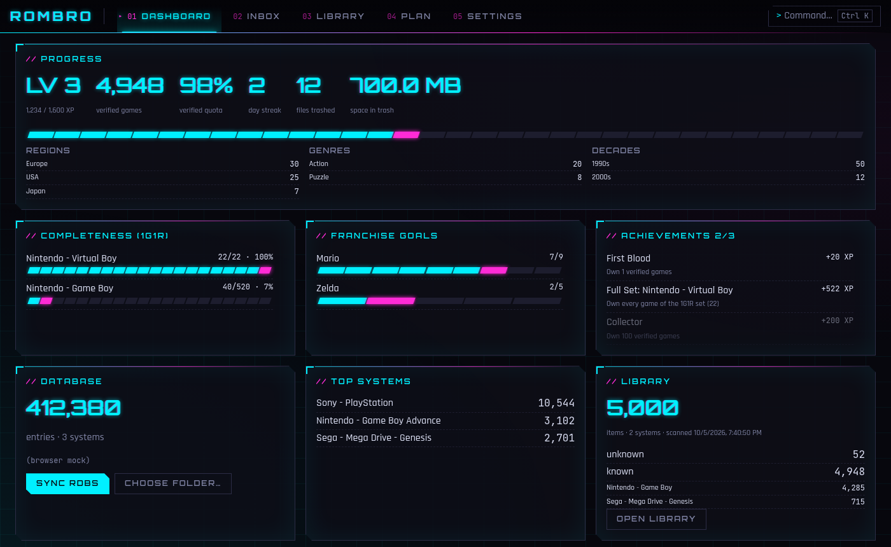
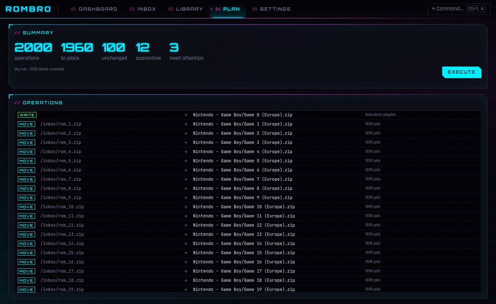
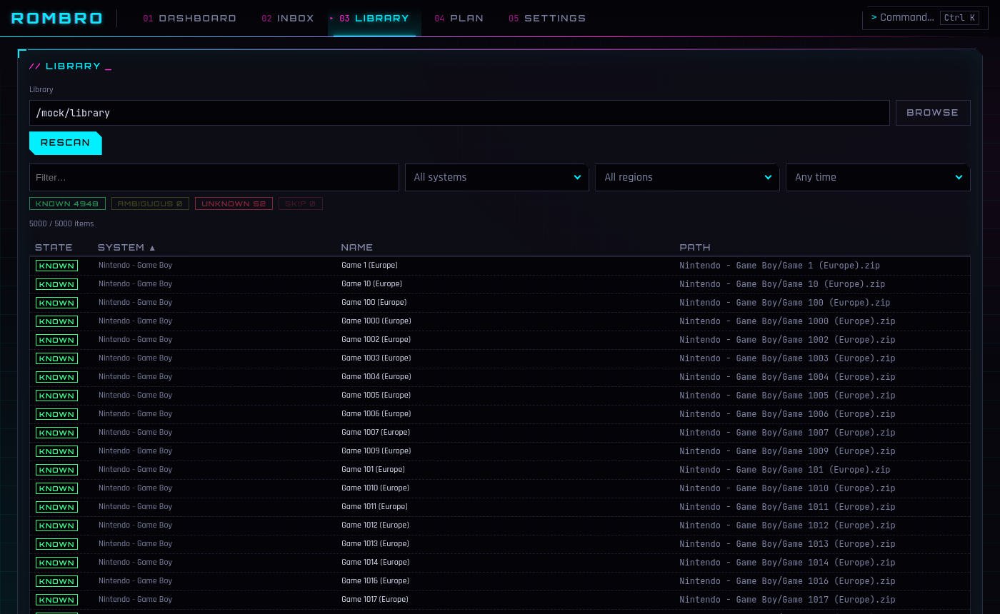

<div align="center">

# ROMBRO

**Your ROM pile, curated.**
Verify every file against the RetroArch databases, keep one copy per game,
and drop everything into a clean, RetroArch-ready library – with undo for every step.

[](https://github.com/khaledchaar-cpu/rombro/actions/workflows/ci.yml)




</div>

## Features

- 🔍 **Hash-verified** – CRC32/SHA-1 (and serials for discs) matched against all RetroArch RDBs, no guessing from file names.
- 💿 **Discs & archives** – cue/bin, gdi, CHD, zip and 7z; multi-disc sets stay together, unknown archives are never torn apart.
- 🌍 **1G1R** – one release per game, picked by your region and language order; betas, protos, demos & co. filtered out.
- 🕹️ **Arcade aware** – FBNeo and MAME romsets keep their short names, CHDs travel along, BIOS sets land where the cores look.
- 📦 **Safe import** – move, copy, hardlink or reflink; every run is a plan you review first, unknown files go to quarantine, nothing is ever deleted.
- ↩️ **Undo everything** – each run is journaled and can be rolled back.
- 🎮 **RetroArch-ready** – playlists and thumbnails are written for you.
- 🏆 **Gamification** – XP, levels, streaks, completeness per system, franchise goals and achievements.
- ⌨️ **Keyboard first** – command palette (`Ctrl K`) and a full CLI for scripting.

<table>
  <tr>
    <td></td>
    <td></td>
  </tr>
  <tr>
    <td align="center"><sub>Review the plan before anything moves</sub></td>
    <td align="center"><sub>Browse and filter the library</sub></td>
  </tr>
</table>

<sub>Screenshots use mock data.</sub>

## Install

Download the bundle for your OS from the [releases page](https://github.com/khaledchaar-cpu/rombro/releases) (AppImage/deb, dmg, msi/exe).
The `rombro` CLI ships next to it as a separate binary.

The bundles are **not code-signed**, so the OS warns on first launch:

- **macOS:** right-click the app → *Open* → *Open*, or run
  `xattr -dr com.apple.quarantine /Applications/ROMBRO.app`.
- **Windows:** SmartScreen → *More info* → *Run anyway*.
- **Linux:** AppImage needs `chmod +x`; the deb installs normally.

## First run

1. Install RetroArch and update its databases (*Online Updater → Update Databases*).
2. Open ROMBRO → Dashboard → **Sync RDBs**. The folder is detected automatically:

   | OS | RetroArch RDB folder |
   |---|---|
   | Linux | `~/.config/retroarch/database/rdb` (also Flatpak, Snap, `/usr/share/libretro`) |
   | macOS | `~/Library/Application Support/RetroArch/database/rdb` |
   | Windows | `%APPDATA%\RetroArch\database\rdb`, `C:\RetroArch-Win64\database\rdb` |

   Elsewhere: **Choose folder…**, or set `ROMBRO_RDB_DIR`.
3. Pick an inbox and a library folder, review the plan, execute. Undo is always available.

## Library layout

```
<library>/
  <System>/            games, one folder per RetroArch system
  _playlists/          RetroArch playlists (.lpl)
  _bios/               console BIOS → point RetroArch's System/BIOS directory here
  _bios/fbneo/         FBNeo BIOS sets (neogeo.zip, …)
  _quarantine/         unknown or broken files, never deleted
  _trash/              discarded files, restorable via Undo
```

BIOS files are placed automatically and hidden in the app. MAME cores only look next to
the romsets, so their BIOS sets stay in the `MAME …` system folder.

ROMBRO's own data lives in the OS data directory (`rombro/rombro.db`), thumbnails in the
cache directory (`rombro/thumbnails`).

## CLI

```
rombro db sync [<rdb-dir>]          # import RDBs
rombro scan <dir> [--unknown]       # identify files
rombro g1r "<System>" [--filter x]  # show 1G1R picks
rombro import <inbox> <lib> --dry-run
rombro audit <lib> | undo | resolve <file> [n]
```

## Build from source

Rust (stable, ≥ 1.85), Node 22 and pnpm; on Linux additionally
`libwebkit2gtk-4.1-dev librsvg2-dev`.

```
cd ui && pnpm install && pnpm tauri build   # app bundles in target/release/bundle/
cargo build --release -p rombro-cli         # CLI
./scripts/check.sh                          # fmt, clippy, tests, typecheck
```

CI (`.github/workflows/ci.yml`) runs the checks and builds bundles for Linux, macOS and
Windows; pushing a `v*` tag creates a draft release.

## License

MIT – ROMBRO ships no ROMs or BIOS files. Use it only with games you own.
